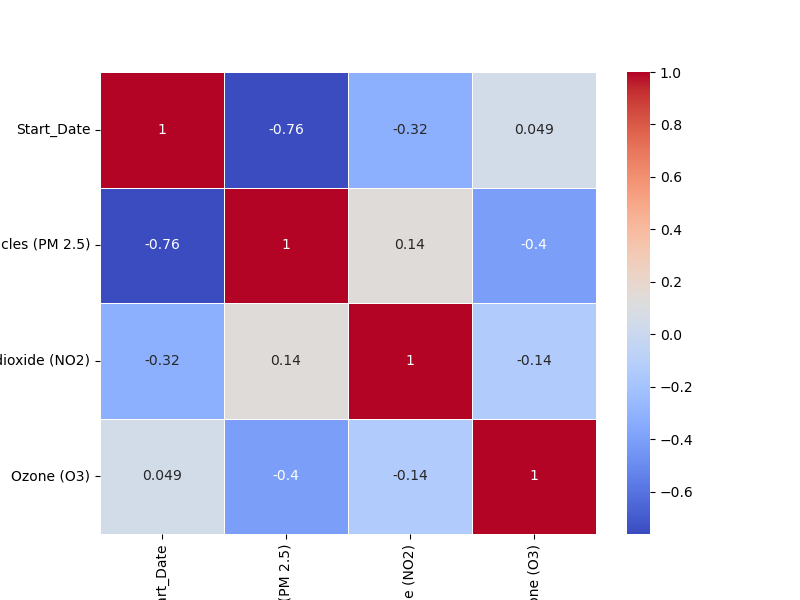

# Air Quality and Its DownFall in New York

**Name**: Merjem Memic

**Affiliation**: University of Michigan

**Email**: merjemm@umich.edu

This is an analysis of a public Kaggle dataset of Air Quality measures in New York.
The dataset used for all analysis can be found at <https://www.kaggle.com/datasets/abidhussai512/air-quality-in-usa>. 

The analysis presented was originally created as the data analysis project as part of the W25 Datathon through the UMich Undergrad Statistics Club. The website is my work and was made after the completition of the datathon. 

## Motivation

The Air Quality across the world is worsening. As discussed in an article by [PBS](<https://www.pbs.org/newshour/show/why-air-quality-is-getting-worse-in-many-places-and-how-it-puts-human-health-at-risk>), air quality is worsening all across and this can pose health risks to people who live in highly polluted areas. For example, it is stated "It's responsible for nearly 7 million premature deaths every year worldwide."

However, according to the [New York government](<https://www.nyc.gov/site/doh/health/health-topics/air-quality-air-pollution-protection.page>), “New York City air quality is improving, but our health impact estimates from 2015 to 2017 found that fine particle pollution alone each year caused:
At least 2,000 deaths
About 1,400 hospital admissions for lung and heart conditions
3,750 emergency department admissions for asthma based on levels.”
Interestingly, they state here that the air quality is getting better in New York. This is unlike many places in the world as mentioned in the first article. In addition, there are conflicting reports. This [Report Air Quality Worsens in NYC Environmental Justice Areas](
<https://www.publicnewsservice.org/2024-06-25/air-pollution/report-air-quality-worsens-in-nyc-environmental-justice-areas/a90998-1>) states differently. 

More infomration about pollution's impact [here](https://www.lung.org/research/sota/key-findings).

## Exploratory Data Analysis

The dataset consists of 18,000+ observations of 3 main air quality measurements from 2014 to 2023.

|    |   Unique ID |   Indicator ID | Name                                  | Measure        | Measure Info   | Geo Type Name   |   Geo Join ID | Geo Place Name           | Time Period   | Start_Date   |   Data Value |   Message |
|---:|------------:|---------------:|:--------------------------------------|:---------------|:---------------|:----------------|--------------:|:-------------------------|:--------------|:-------------|-------------:|----------:|
|  0 |      179772 |            640 | Boiler Emissions- Total SO2 Emissions | Number per km2 | number         | UHF42           |           409 | Southeast Queens         | 2015          | 01/01/2015   |          0.3 |       nan |
|  1 |      221956 |            386 | Ozone (O3)                            | Mean           | ppb            | UHF34           |        305307 | Upper East Side-Gramercy | Summer 2014   | 06/01/2014   |         24.9 |       nan |
|  2 |      221806 |            386 | Ozone (O3)                            | Mean           | ppb            | UHF34           |           103 | Fordham - Bronx Pk       | Summer 2014   | 06/01/2014   |         30.7 |       nan |
|  3 |      221836 |            386 | Ozone (O3)                            | Mean           | ppb            | UHF34           |           204 | East New York            | Summer 2014   | 06/01/2014   |         32   |       nan |
|  4 |      221812 |            386 | Ozone (O3)                            | Mean           | ppb            | UHF34

The most vital column are the `Name` column and `Data Value` column since these explain the measurement taes and the actual number received.

A central column to my analysis is the `Geo Place Name` column which names a general neighborhood in New York. There are slightly different names that require data cleaning to prevent double counting. 

<iframe
  src="plots/nyc_neighborhoods_map.html"
  width="800"
  height="450"
  frameborder="0"
></iframe>

This map displays the general position of every neigborhood across New York. The red neighbordhoods are those that mentioned directly in the dataset. 

## Research Question 1

Is there any correlation between the PM, Ozone, and NO2 measures?

It might be interesting if they each peak at certain times or if any patterns emerge between them since they are all meant to measure the air quality.

### Methodology and Findings

First, for this question, we need to aggregate all measure for the entire state. We do this by  taking the average of every measure since the timing line up. 

Now, we plot them all on one plot to get an initial idea of their similarities.

<iframe
  src="plots/pm_a2_o2.html"
  width="800"
  height="450"
  frameborder="0"
></iframe>

However, this isn't very helpful since the measures are very different. 
So, we turn to calculating the Pearson coefficient between time and each measurement type. 

A peason coefficient above 0.5 is considered significant. 
Using the correlation matrix, we can see there isn't much correlation between the measures. However, PM 2.5 is highly correlated with time. We will use this to inform our further analysis. 

## Research Question 2

Is the average Fine Particle values decreasing for all of New York?
Knowing PM2.5 correlated with time, is there a specific trend that is present in the data?

### Methodology and Findings

Firstly, let just plot the PM 2.5 for every neighbordhood. 

<iframe
  src="plots/all_fm_per_state.html"
  width="800"
  height="450"
  frameborder="0"
></iframe>

Even with just a basic plot, we can see there is a downwards trend in the PM 2.5 values. So, let perform a linear regression on them to find the line of best fit.

<iframe
  src="plots/base_model_test_p3a.html"
  width="800"
  height="450"
  frameborder="0"
></iframe>

That line look pretty good, but lets do a search if any degrees do better according to MSE. WE will do this using `GridSearchCV` and degrees of 1 to 5. 
However, after doing so, the best chosen degree is 1 so we can conclude that there exists a linear relationship between date and PM 2.5. 

## Conclusion

Well, this seems to be good news that PM 2.5 is generally decreasing accross New York. Further research would have ot be done if there are specific neighbordhoods that are more affected compared to others. 

It is likely there are external factors that impacting air quality that aren't cnsidered here. 
